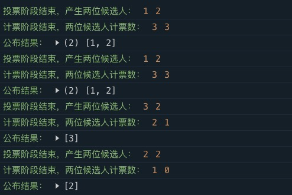

# 投票问题

```
给你一个有序数组 nums ，请你 原地 删除重复出现的元素，使每个元素 最多出现两次 ，返回删除后数组的新长度。
不要使用额外的数组空间，你必须在 原地 修改输入数组 并在使用 O(1) 额外空间的条件下完成。


示例 1：

输入：[1,2,5,9,5,9,5,5,5]
输出：5
示例 2：

输入：[3,2]
输出：-1
示例 3：

输入：[2,2,1,1,1,2,2]
输出：2

来源：力扣（LeetCode）
链接：https://leetcode.cn/problems/find-majority-element-lcci
著作权归领扣网络所有。商业转载请联系官方授权，非商业转载请注明出处。
```

方法1:  Map

```
时间复杂度：O(n), 空间复杂度：O(n)
```

```javascript
var majorityElement = function (nums) {
  let middle = nums.length >> 1;
  let map = new Map();

  for (let i = nums.length - 1; i >= 0; i--) {
    if (!map.has(nums[i])) {
      map.set(nums[i], 1);
    } else {
      map.set(nums[i], map.get(nums[i]) + 1);
    }
  }

  for (const [key, value] of map) {
    if (value > middle) return key;
  }
  return -1;
};

console.assert(majorityElement([1, 2, 5, 9, 5, 9, 5, 5, 5]) === 5);
console.assert(majorityElement([3, 2]) === -1);
console.assert(majorityElement([2, 2, 1, 1, 1, 2, 2]) === 2);
```

方法2: 摩尔投票法

```
时间复杂度：O(n), 空间复杂度：O(1)
```

```javascript
var majorityElement = function (nums) {
  let middle = nums.length >> 1;
  let candidate,
    counter = 0;

  for (let i = 0, len = nums.length; i < len; i++) {
    if (counter === 0) {
      candidate = nums[i];
      counter++;
    } else {
      if (nums[i] === candidate) {
        counter++;
      } else {
        counter--;
      }
    }
  }

  if (counter) {
    counter = 0; // 清零用于统计candidate票数
    for (let i = nums.length - 1; i >= 0; i--) {
      if (nums[i] === candidate) counter++;
    }
    if (counter > middle) {
      return candidate;
    }
  }
  // console.log('candidate ', candidate, counter);
  return -1; // 不存在
};

console.assert(majorityElement([1, 2, 5, 9, 5, 9, 5, 5, 5]) === 5);
console.assert(majorityElement([3, 2]) === -1);
console.assert(majorityElement([2, 2, 1, 1, 1, 2, 2]) === 2);
```

摩尔投票法

[演示网站](https://www.cs.utexas.edu/\~moore/best-ideas/mjrty/index.html)

```
As we sweep we maintain a pair consisting of a current candidate and a counter. 
Initially, the current candidate is unknown and the counter is 0.
When we move the pointer forward over an element e:
    If the counter is 0, we set the current candidate to e and we set the counter to 1.
    If the counter is not 0, we increment or decrement the counter according to whether e is the current candidate.
When we are done, the current candidate is the majority element, if there is a majority.
演示网站：https://www.cs.utexas.edu/~moore/best-ideas/mjrty/index.html
时间复杂度：O(n), 空间复杂度：O(1)
```

```
给定一个大小为 n 的整数数组，找出其中所有出现超过 ⌊ n/3 ⌋ 次的元素。


示例 1：

输入：nums = [3,2,3]
输出：[3]
示例 2：

输入：nums = [1]
输出：[1]
示例 3：

输入：nums = [1,2]
输出：[1,2]

来源：力扣（LeetCode）
链接：https://leetcode.cn/problems/majority-element-ii
著作权归领扣网络所有。商业转载请联系官方授权，非商业转载请注明出处。
```

```javascript
var majorityElement = function (nums) {
  // 最小出现次数
  let MIN_OCCURRENCE = (1 + nums.length / 3) >> 0; // 正整数取整
  let can = nums[0],
    can2 = nums[0],
    cnt = 0,
    cnt2 = 0;
  let tuple = [];

  // 配对阶段
  for (let i = 0, len = nums.length; i < len; i++) {
    if (nums[i] === can) {
      cnt++;
      continue;
    }
    if (nums[i] === can2) {
      cnt2++;
      continue;
    }

    if (cnt === 0) {
      // 更换候选人
      can = nums[i];
      cnt++;
      continue;
    }
    if (cnt2 === 0) {
      // 更换候选人
      can2 = nums[i];
      cnt2++;
      continue;
    }

    // 投票抵消
    // 数据分为三类，一类是can,一类是can2，还有其他
    // 当为其他的时候，就会抵消can和can2的计数器
    cnt--;
    cnt2--;
  }
  console.log('投票阶段结束，产生两位候选人：', can, can2);

  // 计数阶段
  if (cnt) {
    cnt = 0;
    for (let i = nums.length; i >= 0; i--) {
      if (nums[i] === can) cnt++;
    }
  }
  if (cnt2) {
    cnt2 = 0;
    for (let i = nums.length; i >= 0; i--) {
      if (nums[i] === can2) cnt2++;
    }
  }
  console.log('计票阶段结束，两位候选人计票数：', cnt, cnt2);

  if (cnt >= MIN_OCCURRENCE) tuple.push(can);
  if (cnt2 >= MIN_OCCURRENCE) tuple.push(can2);
  console.log('公布结果：', tuple);
  return tuple;
};

console.assert(majorityElement([1, 1, 1, 3, 3, 2, 2, 2]).includes(1));
console.assert(majorityElement([1, 1, 1, 3, 3, 2, 2, 2]).includes(2));
console.assert(majorityElement([3, 2, 3]).includes(3));
console.assert(majorityElement([2]).includes(2));
```

<figure><figcaption><p>Console 打印结果</p></figcaption></figure>
